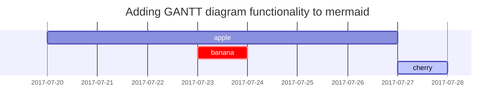

This post is to show Markdown syntax rendering on [**Chirpy**](https://github.com/cotes2020/jekyll-theme-chirpy/fork), you can also use it as an example of writing. Now, let's start looking at text and typography.

## Introduction
Continuing on with the Windows exploit journey, it's time to start exploiting kernel-mode drivers and learning about writing exploits for ring 0. As I did with my OSCE prep, I'm mainly blogging my progress as a way for me to reinforce concepts and keep meticulous notes I can reference later on. I can't tell you how many times I've used my own blog as a reference for something I learned 3 months ago and had totally forgotten. 

This series will be me attempting to run through every exploit on the [Hacksys Extreme Vulnerable Driver](https://github.com/hacksysteam/HackSysExtremeVulnerableDriver). **I will be using HEVD 2.0**. I can't even begin to explain how amazing a training tool like this is for those of us just starting out. There are a ton of good blog posts out there walking through various HEVD exploits. I recommend you read them all! I referenced them heavily as I tried to complete these exploits. Almost nothing I do or say in this blog will be new or my own thoughts/ideas/techniques. There were instances where I diverged from any strategies I saw employed in the blogposts out of necessity or me trying to do my own thing to learn more.

**This series will be light on tangential information such as:**
+ how drivers work, the different types, communication between userland, the kernel, and drivers, etc
+ how to install HEVD,
+ how to set up a lab environment
+ shellcode analysis

The reason for this is simple, the other blog posts do a much better job detailing this information than I could ever hope to. It feels silly writing this blog series in the first place knowing that there are far superior posts out there; I will not make it even more silly by shoddily explaining these things at a high-level in poorer fashion than those aforementioned posts. Those authors have way more experience than I do and far superior knowledge, I will let them do the explaining. :)

This post/series will instead focus on my experience trying to craft the actual exploits.

## HEVD Series Change
I will no longer be using Python ctypes to write exploits. We will be using C++ from now on. I realize this is a big change for people following along so I've commented the code heavily. 


## Titles
---
# H1 - heading

<h2 data-toc-skip>H2 - heading</h2>

<h3 data-toc-skip>H3 - heading</h3>

<h4>H4 - heading</h4>
---
<br>

## Paragraph

I wandered lonely as a cloud

That floats on high o'er vales and hills,

When all at once I saw a crowd,

A host, of golden daffodils;

Beside the lake, beneath the trees,

Fluttering and dancing in the breeze.

## Lists

### Ordered list

1. Firstly
2. Secondly
3. Thirdly

### Unordered list

- Chapter
	- Setcion
      - Paragraph

### Task list

- [ ] TODO
- [x] Completed
- Hold on
- [ ] Defeat COVID-19
  - [x] Vaccine production
  - [ ] Economic recovery
  - [ ] People smile again

### Description list

Sun
: the star around which the earth orbits

Moon
: the natural satellite of the earth, visible by reflected light from the sun


## Block Quote

> This line to shows the Block Quote.

## Tables

| Company                      | Contact          | Country |
|:-----------------------------|:-----------------|--------:|
| Alfreds Futterkiste          | Maria Anders     | Germany |
| Island Trading               | Helen Bennett    | UK      |
| Magazzini Alimentari Riuniti | Giovanni Rovelli | Italy   |

## Links

<http://127.0.0.1:4000>


## Footnote

Click the hook will locate the footnote[^footnote], and here is another footnote[^fn-nth-2].


## Images

- Default (with caption)


_Full screen width and center alignment_

<br>

- Specify width

{: width="400"}
_400px image width_

<br>

- Left aligned

{: width="350" .normal}

<br>

- Float to left

  {: width="240" .left}
  "A repetitive and meaningless text is used to fill the space. A repetitive and meaningless text is used to fill the space. A repetitive and meaningless text is used to fill the space. A repetitive and meaningless text is used to fill the space. A repetitive and meaningless text is used to fill the space. A repetitive and meaningless text is used to fill the space. A repetitive and meaningless text is used to fill the space. A repetitive and meaningless text is used to fill the space. A repetitive and meaningless text is used to fill the space. A repetitive and meaningless text is used to fill the space. A repetitive and meaningless text is used to fill the space. A repetitive and meaningless text is used to fill the space."

<br>

- Float to right

  {: width="240" .right}
  "A repetitive and meaningless text is used to fill the space. A repetitive and meaningless text is used to fill the space. A repetitive and meaningless text is used to fill the space. A repetitive and meaningless text is used to fill the space. A repetitive and meaningless text is used to fill the space. A repetitive and meaningless text is used to fill the space. A repetitive and meaningless text is used to fill the space. A repetitive and meaningless text is used to fill the space. A repetitive and meaningless text is used to fill the space. A repetitive and meaningless text is used to fill the space. A repetitive and meaningless text is used to fill the space. A repetitive and meaningless text is used to fill the space."

<br>

## Mermaid SVG




## Mathematics

The mathematics powered by [**MathJax**](https://www.mathjax.org/):

$$ \sum_{n=1}^\infty 1/n^2 = \frac{\pi^2}{6} $$

When $a \ne 0$, there are two solutions to $ax^2 + bx + c = 0$ and they are

$$ x = {-b \pm \sqrt{b^2-4ac} \over 2a} $$


## Inline code

This is an example of `Inline Code`.


## Code block

### Common

```
This is a common code snippet, without syntax highlight and line number.
```

### Specific Languages

#### Console

```console
$ env |grep SHELL
SHELL=/usr/local/bin/bash
PYENV_SHELL=bash
```

#### Ruby

```ruby
def sum_eq_n?(arr, n)
  return true if arr.empty? && n == 0
  arr.product(arr).reject { |a,b| a == b }.any? { |a,b| a + b == n }
end
```

#### Shell

```shell
if [ $? -ne 0 ]; then
    echo "The command was not successful.";
    #do the needful / exit
fi;
```

#### Liquid


```liquid

  This product's title contains the word Pack.

```


#### Java

```java
private void writeObject(java.io.ObjectOutputStream s)
  throws java.io.IOException {
  // Write out any hidden serialization magic
  s.defaultWriteObject();
  for (E e: map.keySet()) s.writeObject(e);
}
```

## Reverse Footnote

[^footnote]: The footnote source
[^fn-nth-2]: The 2nd footnote source
